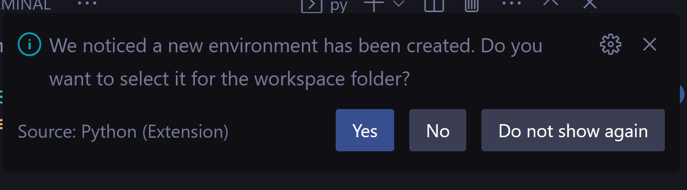

<style>
    .pink-font {
        color: rgb(229, 32, 91)
    }
    .blue-font {
        color: rgb(32, 123, 198);
    }
</style>

# Welcome to your personal chatbot!

First we need to know which technologies we will use.

In first place, we will work with **Langchain** maybe the most important framework to work with LLM in the present.

### <span class="pink-font">Start setting up the environment</span>

1. <span class="blue-font">Initialize a virtual environment with Python</span> 
```py
py -m venv venv
```

2. <span class="blue-font">If a message prompting you to select a new virtual environment</span>



Just press **Yes**. And jump to the step 

Else, continue to the next step.

3. <span class="blue-font">Activate your virtual environment with Python.</span>

You can do it with different commands depending of the operating system, for this guide, copy paste the next prompt to ChatGPT and run the command that he will tell you inside tags _gpt_start_ and _gpt_end_

Prompt to insert in ChatGPT:

<span class="pink-font">
Give me the necessary command to activate my virtual environment in the following format:
_gpt_start_
The command here
_gpt_end_
No explanations needed, just give me the correct answer.
My operating system is:
</span>

And insert your operating system. GPT-3.5-turbo (now we will tell to the models as they are, models) will tell you which command to run. If doesn't work, congratulations, you need to research how to solve it in the traditional way, Stack Overflow or Google. Avoid using Bing 🙂

If it worked (this will probably happen), continue with the next step.

4. <span class="blue-font">Install the requirements</span>

Just run the command

```py
pip install -r requirements.txt
```


5. <span class="blue-font">Set up environment variables</span>
You will need to set up some environment variables for the application to work correctly. Make a copy of the .env.example file and rename it to .env. Then, open this file and replace the placeholders with your actual values. You might need to generate the OpenAI API key in the OpenAI platform.

```
cp .env.example .env
```

<span class="pink-font">Run the application</span>
To run the application, you can use the command:
```
 python main.py 
```
 This will start the application and you should see some output in your terminal.

That's it! If everything goes well, your application should be the answer your looking for about you!

<span class="pink-font">Debugging and troubleshooting</span>
If something goes wrong, don't panic! The error messages that Python gives are usually very informative. Here are some common issues and how to solve them:

- If you're getting an error about a missing module, make sure you have activated your virtual environment and installed all the required packages with pip install -r requirements.txt.
- If you're getting an error about a missing environment variable, make sure you have correctly set up your .env file.
- If you're getting an error about a failed API request, make sure your API keys and secrets are correct and have the necessary permissions.
- If you're still having trouble, don't hesitate to ask for help! You can post a question on Stack Overflow or react me out at Linkedin.

Remember, coding is a process of constant learning and problem-solving. Don't get discouraged by errors and problems, they are just opportunities to learn something new!

Good luck with your chatbot!